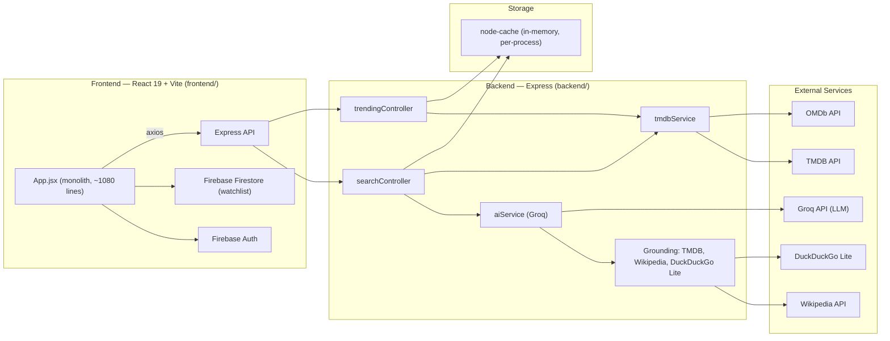

# CineBlaze — Architecture

> Snapshot of the system as it exists today (Phase 0 of the evolution plan). This
> documents what's actually implemented, not the target architecture — see the
> project roadmap for where this is headed.

## Overview

CineBlaze is a monolithic client-server app: a React SPA talks to a single
Express API, which in turn talks to Groq (LLM), TMDB, OMDb, Wikipedia, and
DuckDuckGo. There is no database — all server-side state is an in-memory cache,
and all user-specific state (auth, watchlist) lives in Firebase.



## Repository layout

```
movie-finder/
├── backend/                    # Express API (plain JS, ESM)
│   ├── server.js                # Entry point: express app, CORS, /health
│   ├── config.js                # Env var loading + Groq/TMDB/OMDb config
│   ├── routes/api.js            # All routes, mounted at /api
│   ├── controllers/
│   │   ├── searchController.js  # findMovies, getSimilar, getMediaDetails, getMediaExtras
│   │   └── trendingController.js# getTrendingAll, getTrendingIndian, getTrendingPlatform
│   ├── services/
│   │   ├── aiService.js         # Groq calls, prompt construction, grounding/context
│   │   └── tmdbService.js       # TMDB/OMDb calls, fuzzy title matching, enrichment
│   └── utils/
│       ├── cache.js              # node-cache wrapper
│       └── languageMap.js        # language name → ISO code, genre name → TMDB genre id
├── frontend/                   # React 19 + Vite SPA
│   └── src/
│       ├── App.jsx               # Everything: auth, watchlist, search UI, routing state
│       ├── api.js                # axios instance pointed at the backend
│       └── main.jsx
└── Plan.md                     # Roadmap (untracked/private — see .gitignore)
```

## Request flow: AI-powered search

`POST /api/find-movies { description }` is the core feature. It's a cascade of
increasingly expensive fallbacks, each guarding against the one before it
failing or being unnecessary:

1. **Cache** — keyed on the lowercased/trimmed description. Hit → return immediately.
2. **Fast path: title query** — `isLikelyTitleQuery()` heuristically detects bare
   titles ("Inception", "3 Idiots") via word count + absence of plot keywords.
   Skips the LLM entirely, goes straight to `searchTmdbDirect()`.
3. **Fast path: generic browsing** — `isGenericBrowsingQuery()` detects queries
   like "akshay kumar movies" or "best horror films" via regex patterns. Same
   direct-TMDB path. If TMDB returns nothing, falls through to the AI path
   rather than giving up.
4. **AI path**:
   - `extractStructuredParams()` — one Groq call that decomposes the query into
     `{ language, genres, actors, directors, plot_keywords, media_types, era, is_generic }`.
     These become **hard constraints** in the next prompt (e.g. "must be Marathi",
     "must star X").
   - `callGroqWithFallback()` → `makeGroqRequest()` — builds a grounding context
     (see below) and asks Groq to identify 1-3 real titles as JSON.
   - If the AI returns nothing and the query is short (<8 words), one last
     direct TMDB search is attempted using AI-extracted keywords
     (`extractKeywords()`).
   - Each AI-suggested `{title, year, media_type}` is resolved against TMDB via
     `fetchEnrichedData()`, which does fuzzy/robust title matching (see below).
     If none resolve, falls back to a direct TMDB search with the extracted
     keywords.
5. Successful responses are cached with a TTL that reflects how expensive they
   were to produce (1hr for fast-path direct search, 5min for the short-query
   fallback, 24hr for a fully resolved AI result).

### Grounding (`aiService.getStableContext`)

Before asking Groq to identify a title, the backend fetches "real-world hints"
in parallel and stuffs them into the system prompt, so the model verifies its
guesses against actual data instead of hallucinating:

- Wikipedia search (both structured keywords and the raw query)
- TMDB multi-search (structured keywords)
- DuckDuckGo Lite scrape (raw query — best for specific plot phrasing)
- Actor filmography from TMDB (if an actor was extracted)
- Language-filtered TMDB discover (if a language was extracted)
- Plot-specific TMDB search (if both plot keywords and language are present)

### Fuzzy title matching (`tmdbService.performTmdbSearch`)

TMDB search on an AI-suggested or user-typed title doesn't always hit on the
first try (misspellings, transliteration variance, regional titles). The
fallback chain is:

1. Exact search on the (cleaned) title.
2. If no results and the query has multiple words: retry with a shorter,
   relaxed version.
3. If still nothing: progressively drop leading words ("Ti Sadhya Kay Karte" →
   "Sadhya Kay Karte" → "Kay Karte") and score each candidate result against
   the _original_ full title using Levenshtein-distance similarity. Accept the
   first sub-query whose best candidate scores ≥ 0.70.
4. Once there are results: prefer exact title+year match → exact title (any
   year) → year match only → top popularity result, in that order.

## Groq integration (`aiService.js`)

All Groq calls go through a single `groqChat()` helper (added in Phase 0.3):

- **Retry**: up to `GROQ_MAX_RETRIES` (default 3) attempts per model, exponential
  backoff with jitter. Honors the `Retry-After` header on HTTP 429.
- **Fallback model**: on exhausted retries or 5xx errors, retries against
  `GROQ_FALLBACK_MODEL` before giving up entirely.
- **Config**: `GROQ_API_URL`, `GROQ_MODEL`, `GROQ_FALLBACK_MODEL`,
  `GROQ_MAX_RETRIES` are all env-overridable (see `config.js`), defaulting to
  the Groq-hosted `openai/gpt-oss-120b` primary model.
- **Logging**: one structured JSON line per attempt —
  `{ label, model, attempt, latencyMs, status, promptTokens, completionTokens, queryHash }`
  — where `label` identifies which caller made the request (`extractStructuredParams`,
  `extractKeywords`, `callGroqSimilar`, `makeGroqRequest`).
- Four call sites route through it: structured param extraction, keyword
  extraction (fallback path), "find similar" recommendations, and the main
  identification request.

`parseJsonSafe()` normalizes whatever shape the model returns (bare array,
`{results: [...]}`, `{movies: [...]}`, or any single-key object wrapping an
array) and distinguishes "valid JSON but no matches" from "malformed JSON" in
its logging, so search-quality debugging doesn't require guessing which case
occurred.

## Caching

A single `node-cache` instance (`utils/cache.js`), in-process, TTL-based:

| Data                                     | TTL               | Notes                                            |
| ---------------------------------------- | ----------------- | ------------------------------------------------ |
| Search results (`search_<description>`)  | 1hr / 5min / 24hr | varies by which path in `findMovies` produced it |
| Media details (`details_...`)            | 1hr               |                                                  |
| Ratings (OMDb, `ratings_<title>_<year>`) | 24hr              |                                                  |
| Trending (all/Indian/platform)           | 6hr               |                                                  |

Known limitation: cache is lost on every process restart/redeploy (cold start
on Render), and isn't shared across instances if ever scaled horizontally.
Addressed in Phase 4 (Redis).

## Frontend

`frontend/src/App.jsx` is currently a ~1080-line monolith containing: Firebase
auth state, Firestore-synced watchlist state, search state/API calls, and all
UI (discover view, watchlist view, modals, cards). `frontend/src/api.js` holds
a thin axios wrapper pointed at the backend. There is no routing library, no
component decomposition, and no TypeScript yet — see Phase 2 of the roadmap.

## Known gaps (tracked in the roadmap, not fixed here)

- No database — no persistent user history/preferences beyond Firestore watchlist.
- No TypeScript anywhere.
- Frontend is a single file with no routing.
- No SSR/SEO.
- AI search has no conversation memory or embeddings-based similarity.
